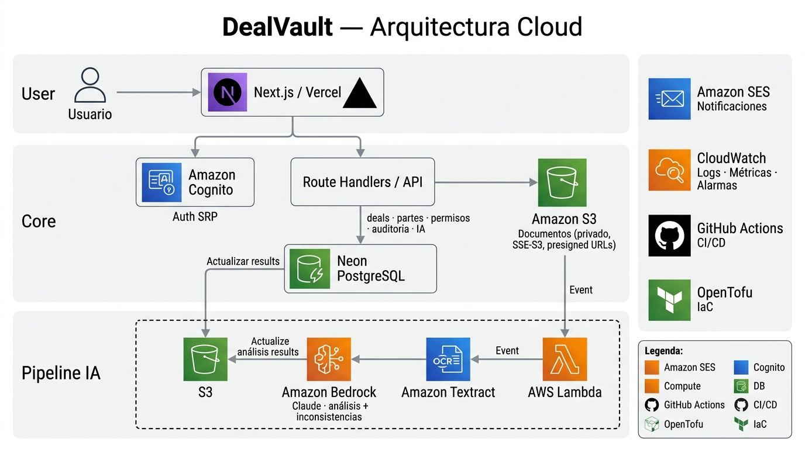

# Arquitectura — DealVault

Deal room seguro para operaciones inmobiliarias de alto valor. Cada operación tiene su
espacio digital donde cada parte (comprador, vendedor, escribano, banco, agente) accede solo
a los documentos que le corresponden, con historial auditable y firma electrónica.

Fuente editable: [`architecture/dealvault-architecture.drawio`](architecture/dealvault-architecture.drawio)

---

## 1. Principios de diseño

| Principio | Cómo se aplica |
|---|---|
| **Serverless y servicios gestionados** | No hay servidores propios: Vercel, Lambda, Cognito, S3 y Neon escalan solos y cuestan ~0 sin uso. |
| **El documento nunca pasa por nuestro servidor** | Subida y descarga directa navegador ↔ S3 con presigned URLs de vida corta. El backend solo autoriza. |
| **Autorización en el backend, no en el cliente** | Toda descarga pasa por una validación de permisos en base de datos antes de firmar la URL. |
| **Auditoría inalterable** | `audit_events` es append-only a nivel base de datos (trigger), no solo por convención del código. |
| **IA como parte del núcleo** | Todo documento subido se procesa con OCR + LLM de forma asíncrona y event-driven. |
| **Costo mínimo** | Se evitan componentes con costo fijo mensual (NAT Gateway, RDS, claves KMS propias) mientras el MVP no los justifique. |
| **Todo reproducible** | Infraestructura en OpenTofu y esquema en migraciones SQL versionadas. |

---

## 2. Flujo principal

Los números corresponden a las flechas del diagrama.

1. El usuario accede a la aplicación web (Next.js en Vercel) por HTTPS.
2. Se autentica contra **Amazon Cognito** (flujo SRP) y recibe un JWT.
3. La API (route handlers de Next.js) valida el JWT y consulta **PostgreSQL en Neon**: operaciones, partes, permisos, auditoría.
4. Para operar con S3, Vercel obtiene **credenciales temporales** de un rol IAM mediante OIDC (sin access keys guardadas).
5. Si la parte tiene permiso sobre el documento, la API **firma una presigned URL** de corta duración.
6. El navegador **sube o descarga el archivo directo a S3** con esa URL.
7. S3 emite un evento `ObjectCreated` que dispara la **Lambda `document-processor`**.
8. La Lambda envía el documento a **Amazon Textract** (OCR de escrituras escaneadas).
9. El texto se procesa con **Amazon Bedrock** con un prompt estructurado: extracción de datos (partes, montos, inmueble, fechas) y detección de inconsistencias entre documentos de la misma operación.
10. El resultado se guarda en `document_extractions` en Neon.
11. Se notifica a las partes por **Amazon SES**.

Los fallos de procesamiento van a una **cola SQS (DLQ)** para reintento y análisis.
Los logs y métricas de las Lambdas van a **CloudWatch**.

---

## 3. Decisiones por componente

| Componente | Elegido | Por qué | Alternativa descartada | Costo estimado (MVP) |
|---|---|---|---|---|
| **Frontend + API** | Next.js en **Vercel** | Deploy continuo desde GitHub, preview por PR, SSR y API en un mismo proyecto. Cero administración. | AWS Amplify: menos maduro para Next.js reciente. Contenedores en ECS: sobredimensionado y con costo fijo. | Plan gratuito |
| **Autenticación** | **Amazon Cognito** | Gestionado, MFA incluido, JWT estándar, integración nativa con IAM. | Clerk / Auth0: mejor DX pero proveedor extra y límites del plan gratuito. | Gratis en el volumen del MVP |
| **Roles y permisos** | Tablas en la base de datos | El rol es **por operación**: una persona puede ser compradora en un deal y vendedora en otro. Cognito solo guarda roles de plataforma (`admin`, `agente`, `participante`). | Grupos de Cognito por rol de operación: no modela roles distintos por operación. | — |
| **Base de datos** | **PostgreSQL en Neon** (AWS us-east-1) | Dominio muy relacional (operaciones, partes, permisos cruzados). Serverless con escala a cero y plan gratuito. Conexión por TLS sin VPC. | **Amazon RDS**: dentro de la VPC, las Lambdas necesitarían NAT Gateway (~30 USD/mes + datos) o VPC endpoints pagos para llegar a SES/Bedrock, y la instancia tiene costo fijo. **DynamoDB**: el modelo de permisos cruzados requiere joins. | Plan gratuito |
| **Almacenamiento** | **Amazon S3** privado | Durabilidad, versionado nativo (un documento nunca se pisa), presigned URLs, eventos para disparar el procesamiento. | Guardar binarios en la base: caro, lento y sin eventos. | Centavos por mes |
| **Cifrado en reposo** | SSE-S3 (AES-256) | Cifrado sin costo ni administración de claves. | SSE-KMS con clave propia: auditoría de uso de la clave, pero ~1 USD/mes por clave más requests. Candidato para producción. | Gratis |
| **Procesamiento** | **AWS Lambda** disparada por S3 | Event-driven, paga solo por ejecución, escala por documento. | Procesar en el request de subida: bloquea al usuario y depende del timeout de Vercel. | Dentro del nivel gratuito permanente de Lambda |
| **OCR** | **Amazon Textract** | Gestionado, preparado para documentos escaneados, se integra con Lambda. | Tesseract en Lambda: gratis pero peor precisión en escaneos y más mantenimiento. | Por página procesada (bajo en el volumen del MVP) |
| **LLM** | **Amazon Bedrock** | Modelos gestionados sin salir de AWS: los documentos no se envían a un proveedor externo, clave para datos sensibles. | API directa de un proveedor de LLM: más simple, pero los documentos salen de la cuenta de AWS. | Por tokens; se usa un modelo chico |
| **Resiliencia** | **SQS** como DLQ | Los documentos que fallan no se pierden: quedan en cola para reintento y diagnóstico. | Reintentos sin DLQ: los fallos persistentes se descartan en silencio. | Nivel gratuito |
| **Notificaciones** | **Amazon SES** | Envío transaccional barato e integrado con IAM. | Servicio de email externo: otro proveedor y otra credencial. | Centavos por miles de mails |
| **Auditoría de negocio** | Tabla `audit_events` append-only | Quién vio, descargó o firmó qué es un **dato de negocio** consultable por operación, protegido por trigger contra UPDATE/DELETE/TRUNCATE. | Solo CloudWatch: es para logs operativos, no para responder "¿quién descargó la escritura?". | — |
| **Observabilidad** | **CloudWatch** | Logs y métricas nativos de Lambda, alarmas. | Stack propio (Grafana/Loki): más control pero requiere operarlo. | Nivel gratuito |
| **Control de costos** | **AWS Budgets** | Alerta al 80% del gasto real y 100% del pronosticado, excluyendo créditos para que avise aunque el plan gratuito los cubra. | Revisar la factura a mano. | Gratis |
| **IaC** | **OpenTofu** | Open source (fork de Terraform bajo MPL), misma sintaxis, estado versionable. | Consola a mano: no reproducible. CDK: acopla la infra a un lenguaje. | Gratis |
| **Migraciones** | SQL plano con **dbmate** | El SQL es la fuente de verdad, independiente del ORM; fácil de revisar en un PR. | Migraciones de un ORM: acoplan el esquema a la herramienta. | Gratis |
| **CI/CD** | **GitHub Actions** + deploy de Vercel | Lint, build y tests en cada PR; deploy automático al mergear. | CI externo: otro servicio más. | Gratis |
| **Región** | us-east-1 (N. Virginia) | Mayor disponibilidad de modelos de Bedrock y de servicios; Neon en la misma región para minimizar latencia. | sa-east-1 (São Paulo): más cerca, pero con menos servicios de IA y precios más altos. | — |

> Los costos son estimaciones del orden de magnitud para el volumen de un MVP y se deben
> validar con la calculadora de precios de AWS antes de cualquier uso productivo.

---

## 4. Seguridad

- **Bucket privado**: bloqueo total de acceso público, política que rechaza tráfico sin HTTPS, versionado y cifrado en reposo.
- **Acceso a documentos**: solo mediante presigned URLs de vida corta, emitidas después de validar `document_permissions` para la parte autenticada.
- **Integridad**: cada versión guarda su SHA-256; la firma electrónica queda asociada al hash de la versión exacta firmada.
- **Firma electrónica, no firma digital**: la Ley 25.506 reserva la firma digital a certificadores licenciados. El MVP implementa firma electrónica con registro auditable (identidad autenticada, hash, fecha, IP).
- **Invitaciones por email**: al primer login, las invitaciones pendientes se vinculan al usuario **solo si el token de Cognito trae `email_verified: true`**.
- **Credenciales**: sin access keys de larga duración en Vercel (OIDC → rol IAM de mínimo privilegio). Secretos fuera del repositorio.

---

## 5. Pendientes conocidos

- Migrar el state de OpenTofu a un backend S3 con lock, para que cualquier integrante pueda aplicar cambios.
- Rol IAM con OIDC para Vercel y roles de mínimo privilegio para cada Lambda.
- Lambda `document-processor`, cola DLQ y configuración de SES en IaC.
- Provisioning de usuario al primer login (upsert por `cognito_sub`).
